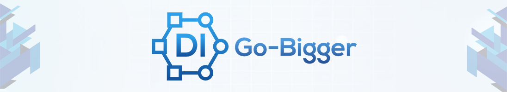

# Go-Bigger: Multi-Agent Decision Intelligence Environment

[](https://pypi.org/project/gobigger/)
[](https://anaconda.org/opendilab/gobigger)
[](https://gobigger.readthedocs.io/en/latest/?badge=latest)
[](https://gobigger.readthedocs.io/zh_CN/latest/?badge=latest)
[](https://github.com/opendilab/GoBigger/actions/workflows/unit_test.yml)
[](https://codecov.io/gh/opendilab/GoBigger)



[GoBigger Doc](https://gobigger.readthedocs.io/en/latest/index.html) ([中文版](https://gobigger.readthedocs.io/zh_CN/latest/))

Welcome to GoBigger v0.2!

GoBigger is an efficient and straightforward *agar-like* game engine and provides various interfaces for game AI development. The game is similar to [Agar](https://agar.io/), a massive multiplayer online action game created by Brazilian developer Matheus Valadares. In GoBigger, players control one or more circular balls on a map. The goal is to gain as much size as possible by eating Food Balls and other balls smaller than the player's balls while avoiding larger ones that can eat the player's balls. Each player starts with one ball, and players can split a ball into two when it reaches a sufficient size, allowing them to control multiple balls.

We pay more attention to the following points:

* A scalable environment that enables the simulation of various teams and agents in each team.
* Rich action space and partially observable observation space.
* More detailed configuration for different kinds of mini-games.


## Outline

* [Overview](#overview)
* [Getting Start](#getting-start)
* [Resources](#resources)
* [Join and Contribute](#join-and-contribute)
* [License](#license)

## Overview

GoBigger allows users to to interact with the multi-agent environment within the basic rules easily. Users can simply get the observation in the game and apply their operations for their agents through the given interface. GoBigger is built with simple rules and actions, though it has complicated observation spaces.

<div align=center></div>

### Basic Rules

To understand the rules in the game, GoBigger provides a few concepts as follows:

* `Match`: GoBigger will allow several agents (4 by default) to join in a match. There are many different units in a match, such as food balls, thorns balls, spore balls and clone balls. When this match ends, each agent should gain more size by eating other balls to get a higher rank. 
* `Agent`: Each agent control a team, including several players (3 by default). Teamwork is essential for an agent to play against other agents.
* `Player`: Each player starts with one ball. To improve the operability of the game, GoBigger provides several operations for a player ball, including `split` and `eject`.
* `Ball`: GoBigger provides 4 kinds of balls in a match.
    - `Food Ball`: Food balls are the neutral resources in the game. If a player ball eats a food ball, the food ball’s size will be parsed to the player ball.
    - `Thorn Ball`: If a player ball eats a thorns ball, the thorns ball’s size will be parsed to the player ball. But at the same time, the player ball will explode and split into several pieces (10 by default).
    - `Spore Ball`: Spore balls are ejected by the player balls. 
    - `Clone Ball`: Clone balls are the balls you can control in the game. You can change its moving direction. In addition, it can eat other balls smaller than itself by covering others’ centers. 

For more details, please refer to [what-is-gobigger](https://gobigger.readthedocs.io/en/latest/tutorial/what_is_gobigger.html).

### Observation Space

GoBigger also provides a wealth of observable information, and the observation space can be divided into two parts. Here is a brief description of the observation space. For more details, please refer to [observation-space](https://gobigger.readthedocs.io/en/latest/tutorial/space.html#observation-space).

#### Global State

The global state provides information related to the whole match, such as the map size, the total time and the last time of the match, and the leaderboard with team name and score.

#### Player States

The player states should be like:

```
{
    player_id: {
        'rectangle': [left_top_x, left_top_y, right_bottom_x, right_bottom_y], # the vision's position in the map
        'overlap': {
            'food': [[position.x, position.y, radius, score], ...], 
            'thorns': [[position.x, position.y, radius, score, vel.x, vel.y], ...], 
            'spore': [[position.x, position.y, radius, score, vel.x, vel.y, owner], ...], 
            'clone': [[[position.x, position.y, radius, score, vel.x, vel.y, direction.x, direction.y, 
                        player_id, team_id], ...],
        }, # all balls' info in vision
        'team_name': team_name, # the team which this player belongs to 
        'score': player_score, # the score of the player
        'can_eject': bool, # if the player can do the `eject` action
        'can_split': bool, # if the player can do the `split` action
    },
    ...
}
```

Here GoBigger provides the player with all the balls' information in his vision. 

### Action Space

In fact, a ball can only move, eject and split in a match. Thus the action space simply includes:

* Moving direction for the player balls.
* Split: Players can split a ball into two when it reaches a sufficient size.
* Eject: Player balls can eject spore in your moving direction.

More details in [action-space](https://gobigger.readthedocs.io/en/latest/tutorial/space.html#action-space).

## Getting Start

### Setup

We test GoBigger within the following system:

* Centos 7.6
* Windows 10
* MacOS Catalina 10.15

And we recommend that your python version is 3.6. 

### Installation

You can simply install GoBigger from PyPI with the following command:

```bash
pip install gobigger
```

If you use Anaconda or Miniconda, you can install GoBigger through the following command:

```bash
conda install -c opendilab gobigger
```

You can also install the newest version through GitHub. First, get and download the official repository with the following command line.

```bash
git clone https://github.com/opendilab/GoBigger.git
```

Then you can install it from the source:

```bash
# install for use
# Note: use `--user` option to install the related packages in the user own directory(e.g.: ~/.local)
pip install . --user
     
# install for development(if you want to modify GoBigger)
pip install -e . --user
```

### Usage

After installation, you can launch your game environment easily according the following code:

```python
import random
from gobigger.envs import create_env

env = create_env('st_v0')
obs = env.reset()
for i in range(1000):
    actions = {0: [random.uniform(-1, 1), random.uniform(-1, 1), -1],
               1: [random.uniform(-1, 1), random.uniform(-1, 1), -1],
               2: [random.uniform(-1, 1), random.uniform(-1, 1), -1],
               3: [random.uniform(-1, 1), random.uniform(-1, 1), -1]}
    obs, rew, done, info = env.step(actions)
    print('[{}] leaderboard={}'.format(i, obs[0]['leaderboard']))
    if done:
        print('finish game!')
        break
env.close()
```

You will see output as follows. It shows the frame number and the leaderboard per frame.

```
[0] leaderboard={0: 3000, 1: 3100.0, 2: 3000, 3: 3100.0}
[1] leaderboard={0: 3000, 1: 3100.0, 2: 3000, 3: 3100.0}
[2] leaderboard={0: 3000, 1: 3100.0, 2: 3000, 3: 3100.0}
[3] leaderboard={0: 3000, 1: 3100.0, 2: 3000, 3: 3100.0}
[4] leaderboard={0: 3000, 1: 3100.0, 2: 3000, 3: 3100.0}
[5] leaderboard={0: 3000, 1: 3100.0, 2: 3000, 3: 3100.0}
[6] leaderboard={0: 3000, 1: 3100.0, 2: 3000, 3: 3100.0}
[7] leaderboard={0: 3000, 1: 3100.0, 2: 3000, 3: 3100.0}
[8] leaderboard={0: 3000, 1: 3100.0, 2: 3000, 3: 3100.0}
[9] leaderboard={0: 3000, 1: 3100.0, 2: 3000, 3: 3100.0}
[10] leaderboard={0: 3000, 1: 3100.0, 2: 3000, 3: 3100.0}
...
```

For more details, you can refer to [gobigger_env.py](https://github.com/opendilab/GoBigger/blob/main/gobigger/envs/gobigger_env.py).


### Real-time Interaction with the Game

GoBigger allows users to play the game on their personal computers in real-time. Several modes are supported for users to explore this game.

#### Play with bot & Partial vision

If you want to play real-time game on your PC, you can launch a game with the following code:

```bash
python -m gobigger.bin.play --mode st --vision-type partial
```

In this mode, please use your mouse to control your balls to move, `Q` means to eject spore in your moving direction, `W` means to split your balls.

<div align=center></div>

#### Play with bot & Full vision

You can launch a game with the following code:

```bash
python -m gobigger.bin.play --mode st --vision-type full
```

<div align=center></div>


### High-level Operations in GoBigger

#### Eject towards the center
<div align=center></div>

#### Teamwork
<div align=center></div>

#### Split and merge
<div align=center></div>

#### Split and eat others
<div align=center></div>

## Resources

For more details, please refer to [GoBigger Doc](https://gobigger.readthedocs.io/en/latest/index.html) ([中文版](https://gobigger.readthedocs.io/zh_CN/latest/)).


## Join and Contribute

Welcome to OpenDI Lab GoBigger community! Scan the QR code and add us on Wechat:


Or you can contact us with [slack](https://opendilab.slack.com/join/shared_invite/zt-v9tmv4fp-nUBAQEH1_Kuyu_q4plBssQ#/shared-invite/email) or email (opendilab.contact@gmail.com).

## License

GoBigger released under the Apache 2.0 license.
